# Como crear una aplicación de recuento de votos en Hyperledger Fabric usando IBM Blockchain Platform

> **NOTA**: este patron de aplicación crea una red blockchain en *IBM Blockchain Platform version **2.5*** usando *Hyperledger Fabric version **1.4***.

Nuestro objetivo es crear una aplicación web como alternativa al recuendo manual de votos, en la que el votante pueda registrarse con su licencia de conducir, obtener un voterId único que se utiliza para iniciar sesión en la aplicación y emitir su voto. El voto se contabiliza en la una de bloques y la aplicación web muestra la clasificación actual de las encuestas.

<br>
### Votación mediante infraestructura de clave pública.

Al inicio de la aplicación, el usuario se registra para votar proporcionando su número de licencia de conducir (o número de ID, 9 dígitos), distrito de registro y nombre y apellido. En este paso, podemos comprobar si la licencia de conducir es válida y no ha sido registrada previamente. Si todo va bien, creamos una clave pública y privada para el votante con nuestra autoridad de certificación que se ejecuta en la nube y agregamos esas claves a la billetera. Para leer más sobre la infraestructura de clave pública y cómo Hyperledger Fabric implementa la identidad con esta tecnología, vaya [aquí](https://hyperledger-fabric.readthedocs.io/en/release-1.4/identity/identity.html).


Después de eso, usamos nuestro número de licencia de conducir para enviar nuestro voto, durante el cual la aplicación verifica si este número de licencia de conducir ha votado antes y le dice al usuario que ya ha enviado un voto si es así. Si todo va bien, se vota la opción elegida por el votante y se actualiza el estado global. Luego, la aplicación actualiza nuestra clasificación actual de las votaciones para mostrar cuántos votos tiene cada opción en tiempo real.

Dado que cada transacción que se envía al servicio de pedidos debe tener una firma de un par de claves pública-privada válida, podemos rastrear cada transacción hasta un votante registrado de la aplicación, en el caso de una auditoría.

En conclusión, aunque esta es una aplicación simple, el desarrollador puede ver cómo pueden implementar una aplicación web Hyperledger Fabric para disminuir la posibilidad de intromisión electoral y mejorar una aplicación de votación mediante el uso de la tecnología blockchain.Cuando el lector haya completado este patrón de código, comprenderá cómo:

* Crear, compilar y utilizar el servicio IBM Blockchain Platform.
* Crear un back-end de blockchain utilizando la API de Hyperledger Fabric
* Crear y usar un clúster de Kubernetes (gratuito) para implementar y monitorear nuestros nodos de Hyperledger Fabric.
* Implementar una aplicación Node.js que interactuará con nuestro contrato inteligente instanciado.
<br>


#Diagrama de flujo:
<br>
<p align="center">
  
</p>
<br>

#Descripción de flujo:
1. El operador de blockchain configura el servicio IBM Blockchain Platform 2.5.
2. IBM Blockchain Platform 2.5 crea una red Hyperledger Fabric en un servicio IBM Kubernetes, y el operador instala y crea una instancia del contrato inteligente en la red.
3. El servidor de aplicaciones Node.js utiliza Fabric SDK para interactuar con la red desplegada en IBM Blockchain Platform 2.5 y crea API para un cliente web.
4. El cliente Vue.js utiliza la API de la aplicación Node.js para interactuar con la red.
5. El usuario interactúa con la interfaz web de Vue.js para emitir su voto y consultar el estado global para ver la clasificación actual de las encuestas.

#Componentes incluidos
* [IBM Blockchain Platform](https://console.bluemix.net/docs/services/blockchain/howto/ibp-v2-deploy-iks.html#ibp-v2-deploy-iks) le brinda un control total de su red blockchain con una interfaz de usuario que puede simplificar y acelerar su viaje para implementar y administrar componentes blockchain en IBM Cloud Kubernetes Service.
* [IBM Cloud Kubernetes Service](https://www.ibm.com/cloud/container-service) crea un clúster de hosts informáticos y despliega contenedores de alta disponibilidad. Un clúster de Kubernetes le permite administrar de forma segura los recursos que necesita para implementar, actualizar y escalar aplicaciones rápidamente.


#Tecnologías destacadas
* [Hyperledger Fabric v1.4](https://hyperledger-fabric.readthedocs.io) es una plataforma para soluciones de contabilidad distribuida, respaldada por una arquitectura modular que ofrece altos grados de confidencialidad, resistencia, flexibilidad y escalabilidad.
* [Node.js](https://nodejs.org) es un entorno de tiempo de ejecución de JavaScript multiplataforma de código abierto que ejecuta código JavaScript del lado del servidor.
* [Vue.js 2.6.10](https://vuejs.org/) Vue.js es un marco de JavaScript de código abierto para crear interfaces de usuario y aplicaciones de una sola página.


## Prerequisitos

 - [Cuenta de IBM Cloud](https://tinyurl.com/y4mzxow5)
  - [Node v8.x o superior y npm v5.x o superior](https://nodejs.org/en/download/)


# Pasos para implementación en la nube

1. [Clonar el repositorio](#step-1-clone-the-repo)
2. [Crear servicio en la nube de IBM](#step-2-create-ibm-cloud-services)
3. [Construir la red](#step-3-build-a-network)
4. [Desplegar el contrato inteligente den la red](#step-4-deploy-voterContract-smart-contract-on-the-network)
5. [Conectar la aplicación con la red](#step-5-connect-application-to-the-network)
6. [Ejecutar la aplicación](#step-6-run-the-application)


## Paso 1. Clonar el repositorio

Haz Git clone de este repo en tu ordenador en la carpeta que elijas, luego ve a la carpeta de la webb-app:
```
$ git clone URL DEL REPO ACÄ!!!!
```

## Paso 2. Crear el servicio de IBM Kubernetes

* Crea [IBM Cloud Kubernetes Service](https://cloud.ibm.com/catalog/infrastructure/containers-kubernetes).  Puedes encontrarlo en el `Catalogo`.  Podemos usar el `Cluster gratito`, y darle un nombre.  Nota, los clusteres gratuitos expiran después de 30 días. <b>El cluster toma alrededor de 20 minutos en estár listo, se paciente!</b>
  
* Una vez que su clúster de Kubernetes esté en funcionamiento, puede implementar su servicio IBM Blockchain Platform en el clúster. El servicio recorre algunos pasos y encuentra su clúster en IBM Cloud para implementar el servicio.

* En el siguiente gif, puedes ver como elegit el clúster gratuito para implementar la plataforma IBM Blockchain.

* Una vez que la plataforma Blockchain se despliega en el clúster de Kubernetes (lo que puede tardar un par de minutos, puede iniciar la consola para comenzar a operar en su red blockchain haciendo clic en Iniciar la plataforma IBM Blockchain) .
  
<br>
<p align="center">
  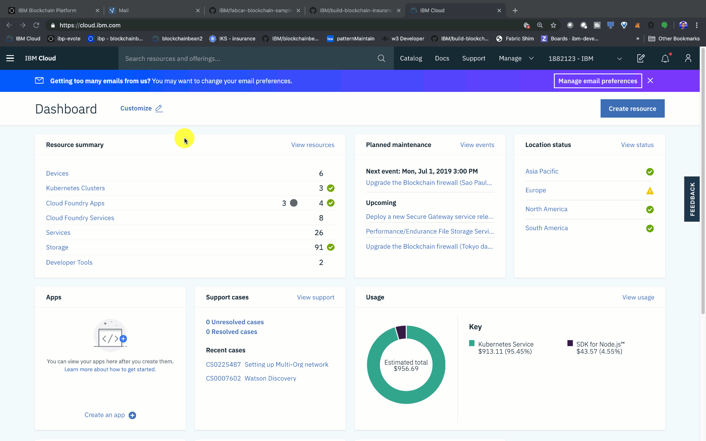
</p>
<br>

## Paso 3. Construye una red

Construiremos una red como lo proporciona [la documentación](https://cloud.ibm.com/docs/blockchain/howto?topic=blockchain-ibp-console-build-network#ibp-console-build-network) de IBM Blockchain Platform . Esto incluirá la creación de un canal con una única organización par con su propio MSP y CA (Autoridad de certificación), y una organización encargada con su propio MSP y CA. Crearemos las respectivas identidades para implementar pares y operar nodos.

### Crea tu organización y tu punto de entrada a tu blockchain

* #### Cree su CA de organización de votantes 
  - Ve a la pestaña <b>Nodos</b> en el panel de navegación de la izquierda y haga clic en <b>Añadir entidad emisora de certificados +</b>.
  - Click en <b>Crear una Añadir entidad emisora de certificados +</b> y click <b>Siguiente</b>.
  - Asígnale un <b>Nombre de Visualización de CA de </b> de `Voter CA`, a <b>ID de inscripción del administrador</b> de `admin` y una <b>Contraseña de administrador de CA </b> de `adminpw`, luego clickea <b>Siguiente</b>.
  - Revisa el sumario y clickea <b>Agregar entidad emisora de certificados</b>.

<br>
<p align="center">
  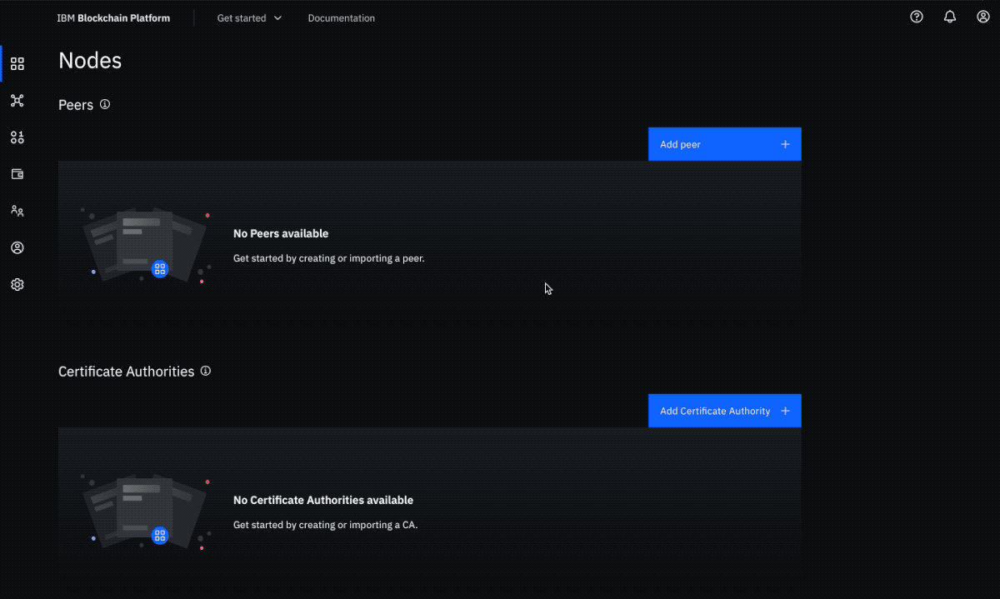
</p>
<br>


* #### Asociar la identidad de administrador de CA de la organización de votantes
  - En la pestaña de nodos, seleccione <b>Voter CA</b> una vez que esté corriendo (indicado con un recuadro verde)
  - Clickee <b>Asociar identidad</b> en el panel de descripcion general de CA.
  - En el panel lateral, seleccione la pestaña <b>Inscribir ID</b>.
  - Proporcione una <b>identificación de inscripción</b> de `admin` y un secreto de inscripción de `adminpw`. Utilice el valor predeterminado de `Voter CA Admin` para el nombre de visualización .
  - Clickea <b>Asociar identidad</b> para agregar la identidad a su billetera y asociar la identidad de administrador con la <b>CA del Votante</b>.

<br>
<p align="center">
  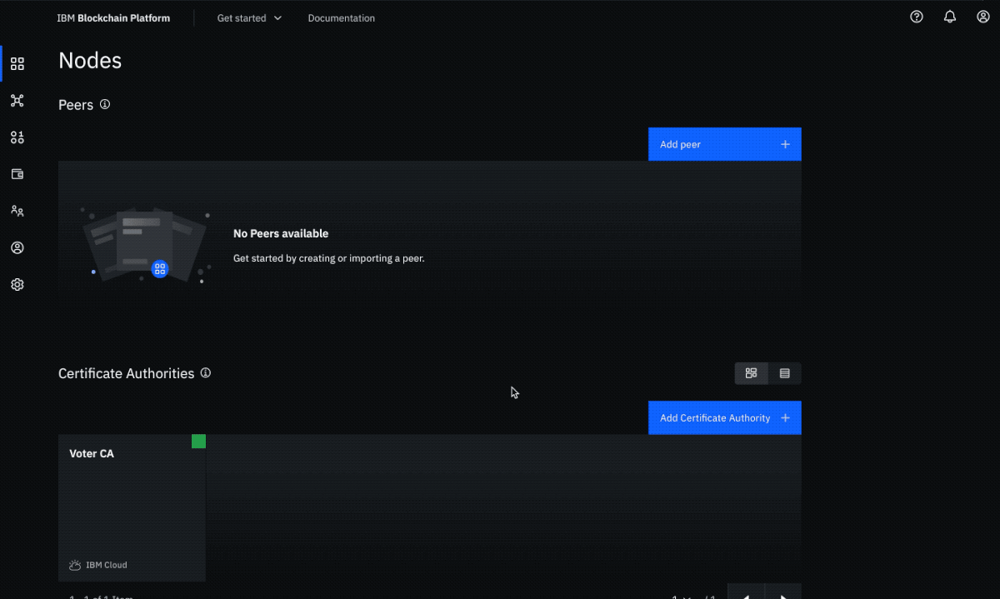
</p>
<br>


* #### Utilice su CA para registrar identidades
  - Seleccione la Autoridad de certificación de la <b>CA</b> del <b>votante</b> y asegúrese de que la adminidentidad que se creó para la CA esté visible en la tabla.
  - El siguiente paso es registrar un administrador para la organización "Voter". Haga clic en el botón <b>Registrar usuario +</b> . Proporcione una identificación de inscripción de `voterAdmin` y un secreto de inscripción de `voterAdminpw`. Establezca el <b>Tipo para esta identidad</b> como `admin`. Especifique Usar afiliación raíz . Deje el campo **Máximo de inscripciones** en blanco. Haga clic en <b>Siguiente</b> .
  - Omita la sección para agregar atributos a este usuario y haga clic en <b>Registrar usuario</b> .
  - Repita el proceso para crear una identidad del par. Haga clic en el botón <b>Registrar usuario +</b> . Proporcione una <b>identificación de inscripción</b> de `peer1` y un secreto de inscripción de `peer1pw`. Establezca el Tipo para esta identidad como peer. Especifique Usar afiliación raíz . Deje el **campo Máximo de inscripciones** en blanco. Haga clic en **Siguiente** .
  - Omita la sección para agregar atributos a este usuario y haga clic en **Registrar usuario** .

<br>
<p align="center">
  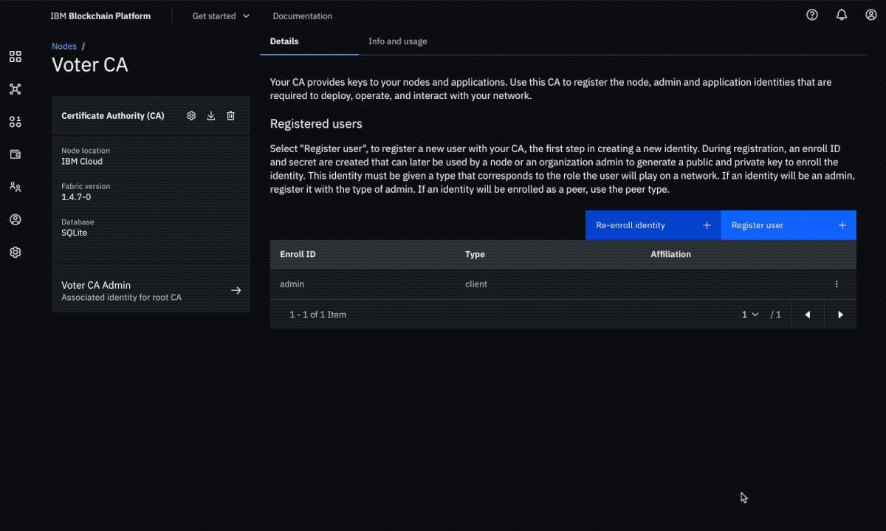
</p>
<br>


* #### Crear la definición de MSP del puerto (par)
  - Vaya a la pestaña **Organizaciones** en el panel de navegación izquierdo y haga clic en **Crear definición de MSP +** .
  - Ingrese el **nombre para mostrar de MSP** como `Voter MSP` y el **ID de MSP** como `votermsp`. Haga clic en **Siguiente** .
  - Especifique `Voter CA` como **Autoridad de certificación raíz** . Haga clic en **Siguiente** .
  - Seleccione la pestaña **Nueva identidad** . Proporcione el **ID de inscripción** y el **secreto de inscripción** para el administrador de su organización, es decir, `voterAdmin` y `voterAdminpw` respectivamente. Luego, ingrese el nombre de **identidad** como `Voter Admin`.
  - Haga clic en el botón **Generar** para inscribir esta identidad como administrador de su organización y agregar la identidad a la billetera. Haga clic en **Exportar** para exportar los certificados de administrador a su sistema de archivos. Haga clic en **Siguiente** .
  - Revise toda la información y haga clic en **Crear definición de MSP** .

<br>
<p align="center">
  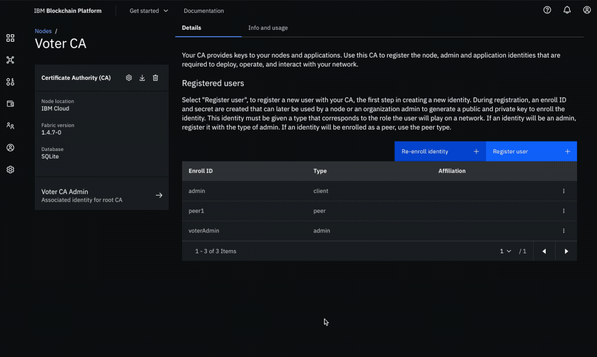
</p>
<br>


* #### Crear un puerto (par)
  - Navegue a la pestaña **Nodos** en la navegación izquierda y haga clic en **Agregar par +** .
  - Haga clic en **Crear un par +** y luego haga clic en **Siguiente** .
  - Asigne el **nombre para mostrar** del par como `Voter Peer` y haga clic en **Siguiente** .
  - En la siguiente pantalla, seleccione `Voter CA` como **Autoridad de certificación** . Luego, proporcione el **ID de inscripción de pares** y el **secreto de inscripción de pares** como `peer1` y `peer1pw` respectivamente. Seleccione la **organización MSP** como `Voter MSP`. Deje el nombre de host de **TLS CSR** en blanco y seleccione `1.4.7-0` en el menú desplegable la **versión de Fabric** . Haga clic en **Siguiente** .
  - Proporcione `Voter Admin` como la identidad administradora del puerto y haga clic en **Siguiente** .
  - Revise el resumen y haga clic en **Agregar par** .

<br>
<p align="center">
  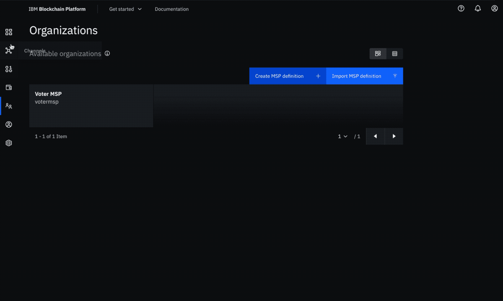
</p>
<br>


### Crea el nodo que ordena transacciones

* #### Crea tu organización CA de ordenado 
  - Ve a la pestaña **Nodos** en el panel de navegación de la izquierda y haga clic en **Agregar autoridad de certificación +** .
  - Haga clic en **Crear una autoridad de certificación +** y haga clic en **Siguiente** .
  - Asígnele un **nombre para mostrar de CA** de `Orderer CA`, un **ID de inscripción de administrador de CA** de `admin` y un secreto de inscripción de administrador de CA de `adminpw`, luego haga clic en **Siguiente**.
  - Revise el resumen y haga clic en **Agregar autoridad de certificación** .

<br>
<p align="center">
  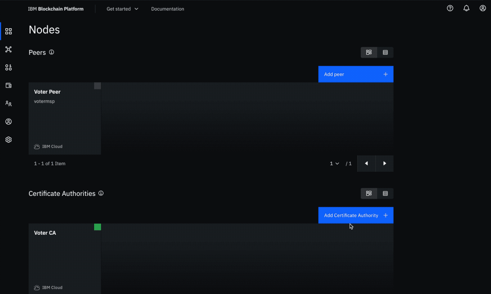
</p>
<br>

* #### Asociar la identidad de administrador de CA de la organización que realiza el pedido
  - En la pestaña **Nodos**, seleccione la CA de Ordenado (**Orderer CA**) una vez que se esté ejecutando (indicado por el cuadro verde en el mosaico).
  - Haga clic en** Asociar identidad** en el panel de descripción general de CA.
  - En el panel lateral, seleccione la pestaña **Inscribir ID** .
  - Proporcione una **identificación** de **inscripción** de `admin` y un **secreto** de **inscripción** de `adminpw`. Utilice el valor predeterminado de Orderer CA Adminpara el nombre para mostrar de la identidad .
  - Haga clic en **Asociar identidad** para agregar la identidad a su billetera y asociar la identidad de administrador con la **CA del ordenante** .

<br>
<p align="center">
  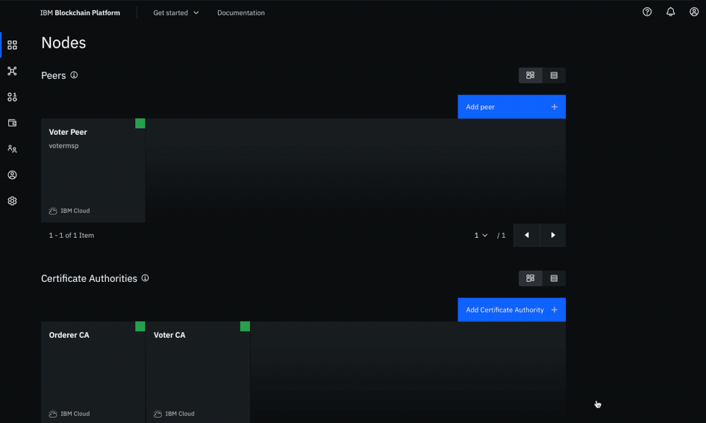
</p>
<br>


* #### Utilice la CA para registrar las identidades de ordenante y administrador de ordenante

  - Seleccione la **Autoridad certificadora de CA** del ordenante y asegúrese de que la identidad `admin` que se creó para la CA esté visible en la tabla.
  - El siguiente paso es registrar un administrador para la organización "Orderer". Haga clic en el botón **Registrar usuario +** . Proporcione una **identificación de inscripción** de `ordererAdmin` y un **secreto de inscripción** de `ordererAdminpw`. Establezca el **Tipo** para esta identidad como `admin`. Especifique **Usar afiliación raíz** . Deje el campo Máximo de inscripciones en blanco. Haga clic en **Siguiente** 
  -Omita la sección para agregar atributos a este usuario y haga clic en **Registrar usuario** .
  - Repita el proceso para crear una identidad del ordenante. Haga clic en el botón **Registrar usuario +** . Proporcione una **identificación** de **inscripción** de `orderer1` y un secreto de inscripción de `orderer1pw`. Establezca el Tipo para esta identidad como `orderer`. Especifique Usar afiliación raíz . Deje el campo Máximo de inscripciones en blanco. Haga clic en **Siguiente** 
  - Omita la sección para agregar atributos a este usuario y haga clic en **Registrar usuario .**

<br>
<p align="center">
  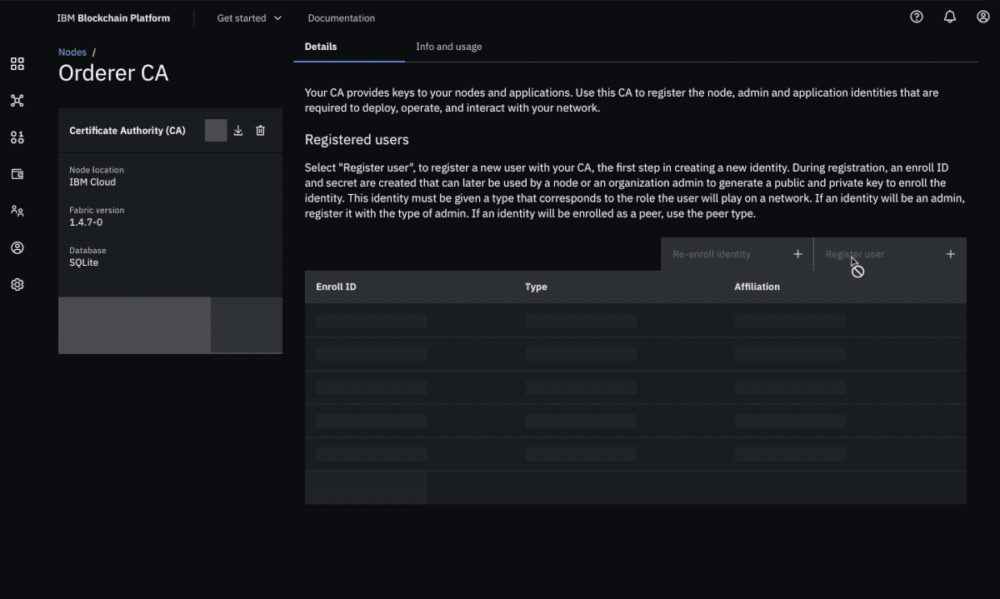
</p>
<br>


* #### Crear la definición de MSP de la organización de ordenado
  - Vaya a la pestaña **Organizaciones** en el panel de navegación izquierdo y haga clic en **Crear definición de MSP +** .
  - Ingrese el **nombre para mostrar de MSP** como `Orderer MSP` y el `ID de MSP` como orderermsp. Haga clic en **Siguiente** .
  - Especifique `Orderer CA` como Autoridad de certificación raíz . Haga clic en **Siguiente** .
  - Seleccione la pestaña **Nueva identidad** . Proporcione el **ID de inscripción** y el **secreto de inscripción** para el administrador de su organización, es decir, `ordererAdmin` y `ordererAdminpw` respectivamente. Luego, ingrese el **nombre de identidad** como Orderer Admin.
  - Haga clic en el botón **Generar** para inscribir esta identidad como administrador de su organización y agregar la identidad a la billetera. Haga clic en **Exportar** para exportar los certificados de administrador a su sistema de archivos. Haga clic en **Siguiente** .
  - Revise toda la información y haga clic en **Crear definición de MSP** .

<br>
<p align="center">
  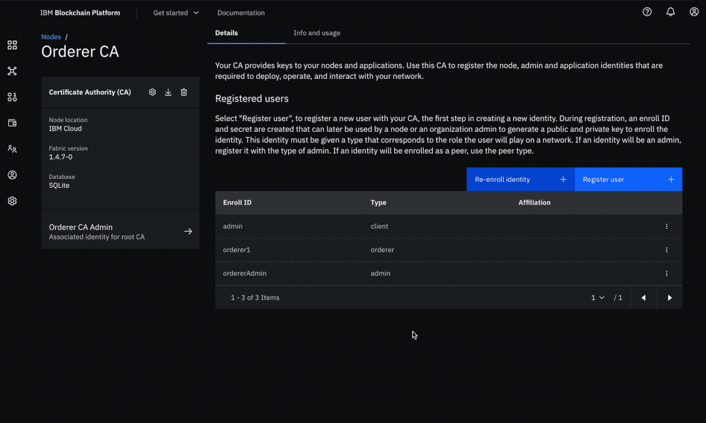
</p>
<br>


* #### Crear un ordenante
  - Navegue a la pestaña **Nodos** en la navegación izquierda y haga clic en **Agregar servicio de ordenadnte+** .
  - Haga clic en **Crear un ordenante +** y luego haga clic en **Siguiente** .
  - Asigne el **nombre para mostrar del ordenante** como `Orderer` y haga clic en **Siguiente** .
  - En la siguiente pantalla, seleccione `Orderer CA` como **Autoridad de certificación** . Luego, proporcione el **ID de inscripción del servicio de ordenante** y el **secreto de inscripción** del **servicio de pedidos** como `orderer1` y `orderer1pw` respectivamente. Seleccione la **organización MSP** como `Orderer MSP`. Deje el **nombre de host de TLS CSR** en blanco y seleccione `1.4.7-0` en el menú desplegable la **versión de Fabric** . Haga clic en **Siguiente** .
  - Indíquelo `Orderer Admin` como la **identidad de administrador** del **ordenante** y haga clic en **Siguiente** .
  - Revise el resumen y haga clic en **Agregar servicio de ordenante**.

<br>
<p align="center">
  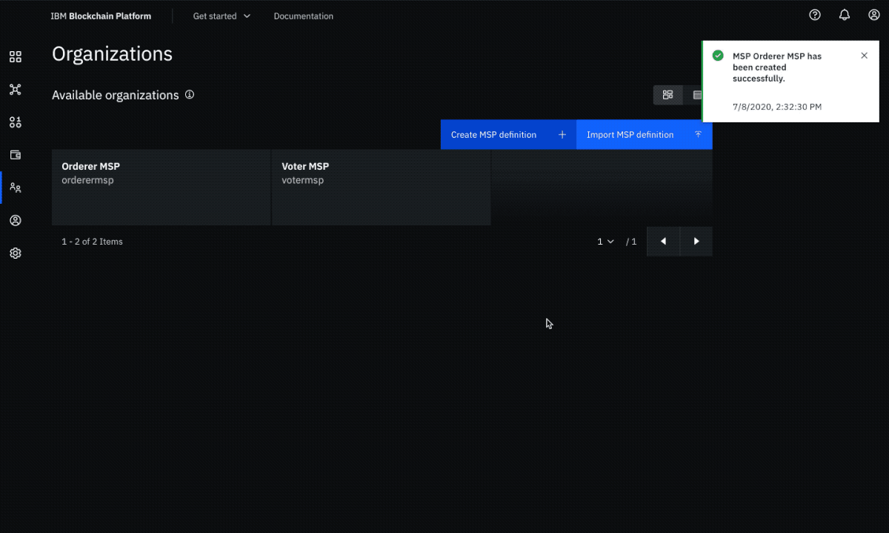
</p>
<br>

* #### Agregar una organización como miembro de consorcio en el servicio ordenante para transaccionar
- Navegue a la pestaña **Nodos** y haga clic en el **Ordenador** que se creó.
- En **Miembros del consorcio** , haga clic en **Agregar organización +** .
- Seleccione la pestaña **ID de MSP existente** . En la lista desplegable, seleccione `Voter MSP (votermsp)`, ya que este es el MSP que representa a la organización "Votante" del par.
- Haz clic en **Agregar organización** .

<br>
<p align="center">
  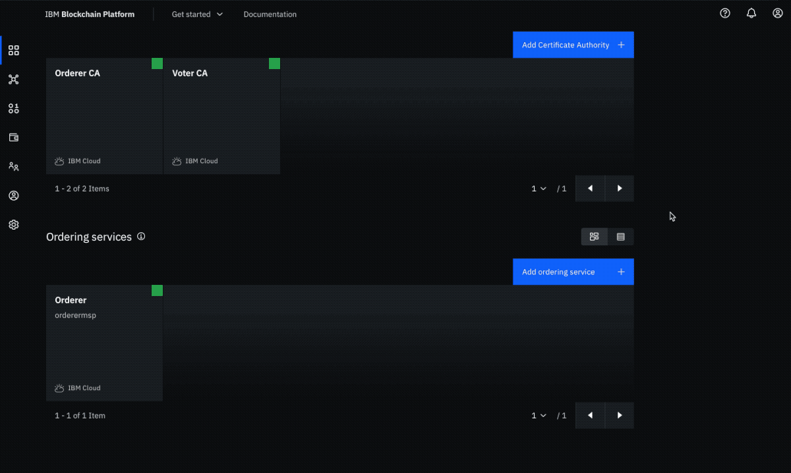
</p>
<br>


### Crear y unirse a un canall

* #### Crear el canal
 - Vaya a la pestaña **Canales** en el panel de navegación izquierdo y haga clic en **Crear canal +** .
- Haga clic en **Siguiente** .
- Dé el **nombre** del **canal** como `mychannel`. Seleccione `Orderer` de la lista desplegable `Servicio de pedidos` . Haga clic en **Siguiente** .
- En **Organizaciones** , seleccione `Voter MSP (votermsp) `de la lista desplegable para agregar la organización "Votante" como miembro de este canal. Haga clic en el botón **Agregar** . Establezca los permisos para este miembro como **Operador** . Haga clic en **Siguiente** .
Deje la **Política** como el valor predeterminado, es decir `1 out of 1`. Haga clic en **Siguiente** .
Seleccione el **creador** del **canal MSP** como `Voter MSP (votermsp)` y la **identidad** como `Voter Admin`. Haga clic en **Siguiente** .
Revise el resumen y haga clic en **Crear canal** .

<br>
<p align="center">
  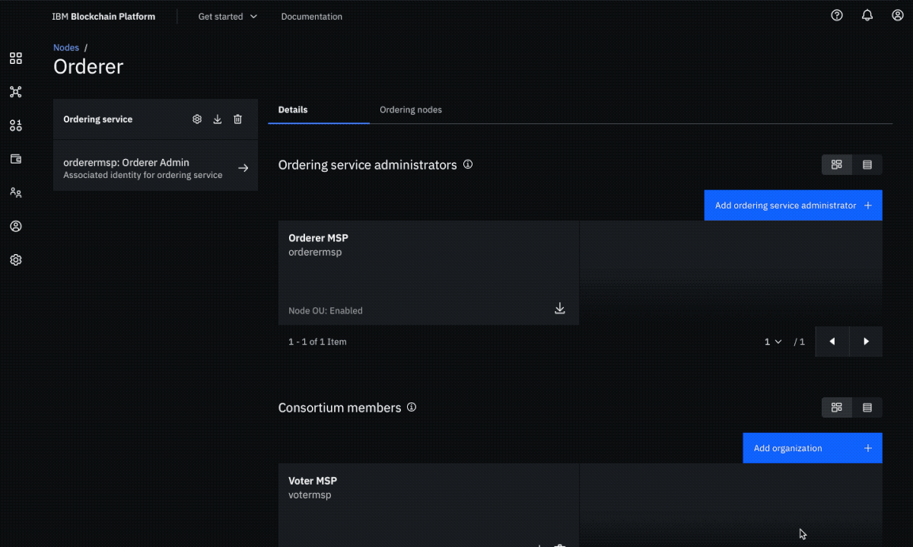
</p>
<br>


* #### Unir el puerto al canal
 -  Haga clic en el canal **mychannel** recién creado .
- En el panel lateral que se abre, en **Elegir entre los pares disponibles** , seleccione `Voter Peer`. Una vez que se selecciona el par, se mostrará una marca de verificación junto a él. Asegúrese de que **Make anchor peer (s)** esté marcado como `Yes`. Haz clic en **Unirse al canal** .

<br>
<p align="center">
  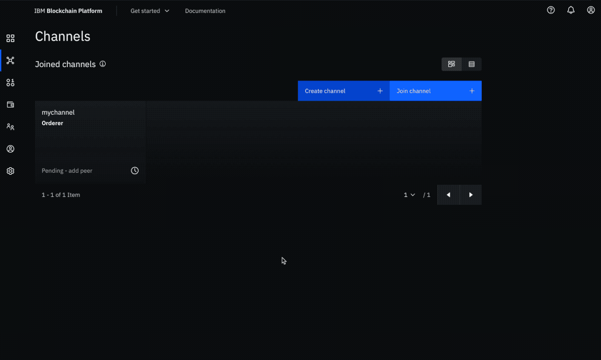
</p>
<br>


## Step 4. Implementar el contrato inteligente de voterContract en la red

* #### Instalar un contrato inteligente
- Ve a la pestaña **Contratos inteligentes** en la navegación izquierda y haz clic en **Instalar contrato inteligente +** .
- Haz clic en **Agregar archivo** .
- Busca la ubicación del archivo del paquete de contrato inteligente voterContract, que se encuentra en la raíz del repositorio que clonamos; se llama al archivo `voterContract.cds.`
- Una vez que se cargue el contrato, haga clic en **Instalar contrato inteligente** .

<br>
<p align="center">
  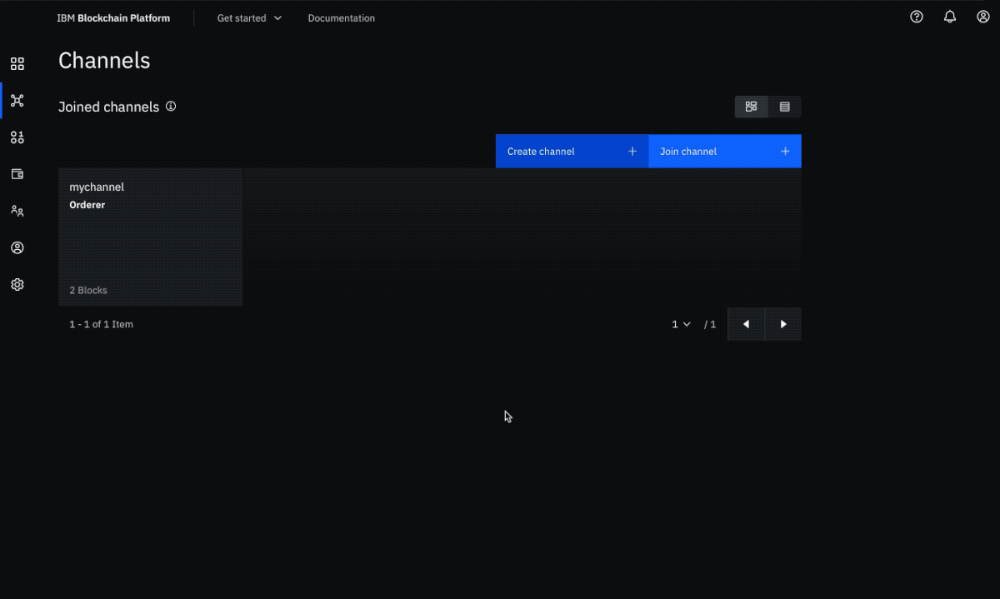
</p>
<br>


* #### Instanciar un contrato inteligente
 - En **Contratos inteligentes instalados** , busque el contrato inteligente de la lista **( Nota: el nuestro se llama voterContract )** instalado en nuestro par y haga clic en **Crear instancia** en el menú **adicional** en el lado derecho de la fila.
- En el panel lateral que se abre, seleccione el canal `mychannel` en el que crear una instancia del contrato inteligente. Haga clic en **Siguiente** .
- Seleccione `Voter MSP` como miembro de la organización que se incluirá en la política de patrocinio. Haga clic en **Siguiente** .
- Omita el paso **Configurar la recopilación de datos privados** y simplemente haga clic en **Siguiente** .
- Dé el **nombre de la función** como `init` y deje los **argumentos** en blanco. **Nota: init es el método en el archivo voterContract.js que inicia los contratos inteligentes en el puerto (par).**
Haga clic en **Crear una instancia de contrato inteligente** .

<br>
<p align="center">
  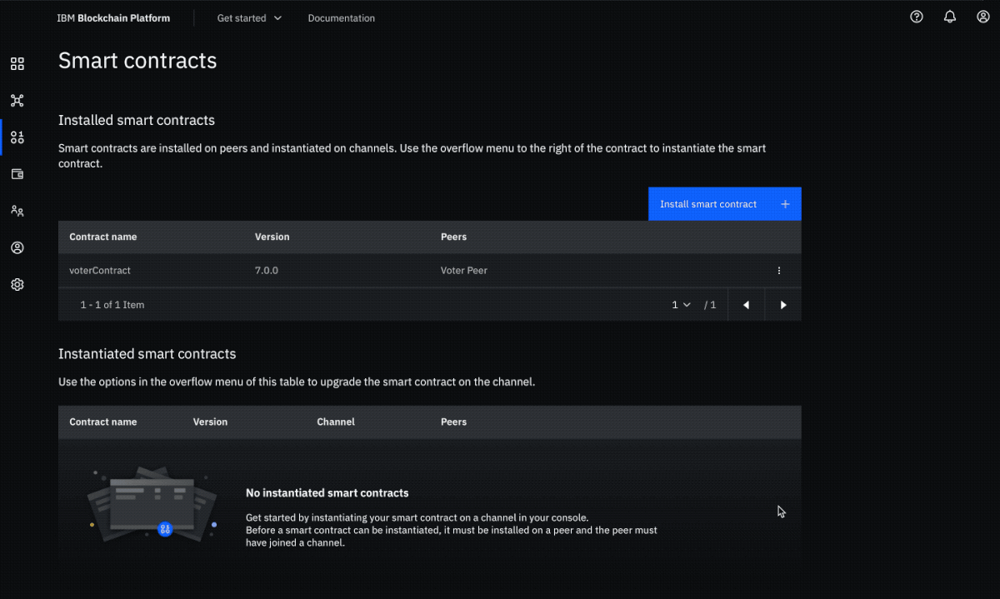
</p>
<br>


## Step 5. Conecte la aplicación a la red

* #### Connect with sdk through connection profile
  - Navigate to the <b>Organizations</b> tab in the left navigation, and click on <b>Voter MSP</b>.
  - Click on <b>Download Connection Profile</b>. 
  - In the side panel that opens up, select `Yes` as the response for <b>Include Voter CA for user registration and enrollment?</b>. Under <b> Select peers to include</b>, select `Voter Peer`. Then click <b>Download connection profile</b>. This will download the connection json which we will use to establish a connection between the Node.js web application and the Blockchain Network.

<br>
<p align="center">
  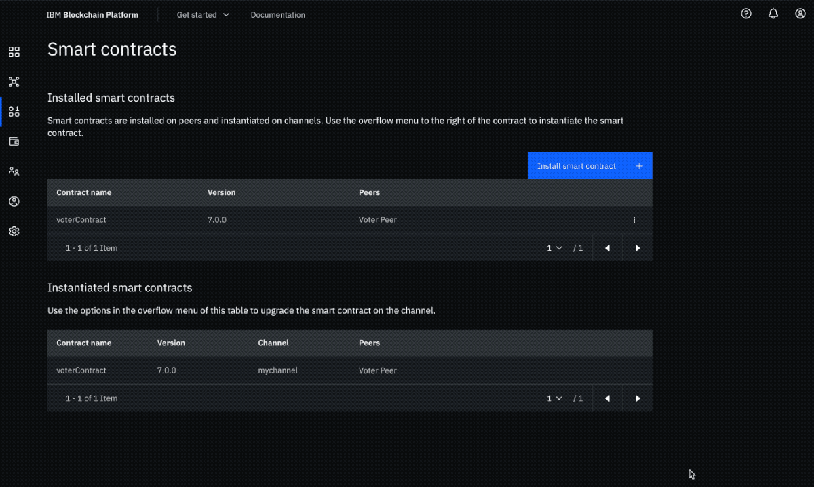
</p>
<br>


* #### Create an application admin
  - Navigate to the <b>Nodes</b> tab in the left navigation, and under <b>Certificate Authorities</b>, choose <b>Voter CA</b>.
  - Click on the <b>Register User +</b> button. Give an <b>Enroll ID</b> of `app-admin` and an <b>Enroll secret</b> of `app-adminpw`. Set the <b>Type</b> for this identity as `client`. Specify to <b>Use root affiliation</b>. Leave the <b>Maximum enrollments</b> field blank. Click <b>Next</b>.
  - Click on <b>Add attribute +</b>. Enter the <b>attribute name</b> as `hf.Registrar.Roles` and the <b>attribute value</b> as `*`. Click <b>Register user</b>.

<br>
<p align="center">
  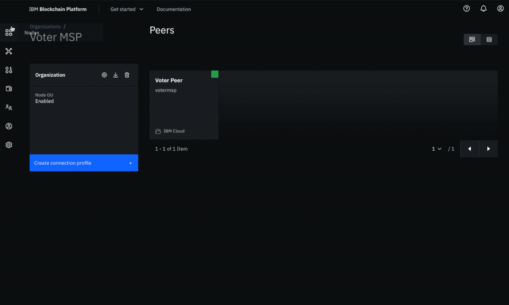
</p>
<br>


* #### Update application connection
  - Copy the connection profile you downloaded into [server folder](./web-app/server)
  - Rename the connection profile you downloaded **ibpConnection.json**
  - Update the [config.json](server/config.json) file with:
    - `ibpConnection.json`.
    - The <b>enroll id</b> and <b>enroll secret</b> for your app admin, which we earlier provided as `app-admin` and `app-adminpw`.
    - The orgMSP ID, which we provided as `votermsp`.
    - The caName, which can be found in your connection json file under "organizations" -> "votermsp" -> certificateAuthorities". This would be like an IP address and a port. You should also use the `https` version of the certificateAuthorities line.
    - The username you would like to register.
    - Update gateway discovery to `{ enabled: true, asLocalhost: false }` to connect to IBP.

<br>
<p align="center">
  
</p>
<br>

- Once you are done, the final version of the **config.json** should look something like this:

```js
{
    "connection_file": "ibpConnection.json",
    "appAdmin": "app-admin",
    "appAdminSecret": "app-adminpw",
    "orgMSPID": "votermsp",
    "caName": "https://173.193.106.28:32634",
    "userName": "V1",
    "gatewayDiscovery": { "enabled": true, "asLocalhost": false }
}
```


## Step 6. Run the application

* #### Enroll admin
  - First, navigate to the `web-app/server` directory, and install the node dependencies.
    ```bash
    cd web-app/server
    npm install
    ```
  
  - Run the `enrollAdmin.js` script
    ```bash
    node enrollAdmin.js
    ```

  - You should see the following in the terminal:
    ```bash
    msg: Successfully enrolled admin user app-admin and imported it into the wallet
    ```

  - Start the server:
    ```bash
    npm start
    ```

<br>
<p align="center">
  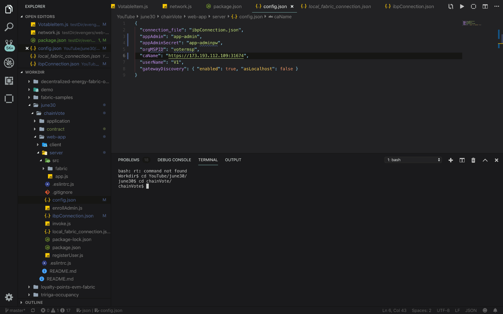
</p>
<br>

* #### Start the web client
  - In a new terminal, open the `web-app/client` folder from the root directory. 
  Install the required dependencies with `npm install`.
    ```bash
    cd web-app/client
    npm install
    ```

  - Start the client:
    ```bash
    npm run serve
    ```

  - In a browser of your choice, go to http://localhost:8080/#/.  If all goes well, you should see 
  something like the gif below:

<br>
<p align="center">
  
</p>
<br>

You can find the app running at http://localhost:8080/  If all goes well, you should be greeted 
with the homepage that says <b>2020 Presidential Election</b>

Now, we can start interacting with the app.

First, we need to register as a voter, and create our digital identity with 
which we will submit our vote with. To do this, we will need to enter 
a uniqueId (drivers license) with a registrarId, and our first and last names.
After we do that, and click `register` the world state will be updated with 
our voterId and our name and registrarId.

If all goes well, you should see `voter with voterId {} is updated in the world state. Use voterId to login above.`
<b>Note: on the first try, the app can take a second to start up. If you click on `register` and nothing 
happens, try to fill in the form and click register again!</b>

Next, we can login to the app with our voterId.

Once we login, we can cast our vote. We will use our voterId again to cast our 
vote. Since we are voting for the presidential
election for 2020, we can choose the party of our liking. Once we are done, we
can choose submit, and then our vote is cast. As long as this voterId hasn't 
voted before, all is well. Next, we can view the poll standings by clicking
`Get Poll Standings` and clicking `Check Poll`. This will query the world 
state and get the current number of votes for each political party.

<br>
<p align="center">
  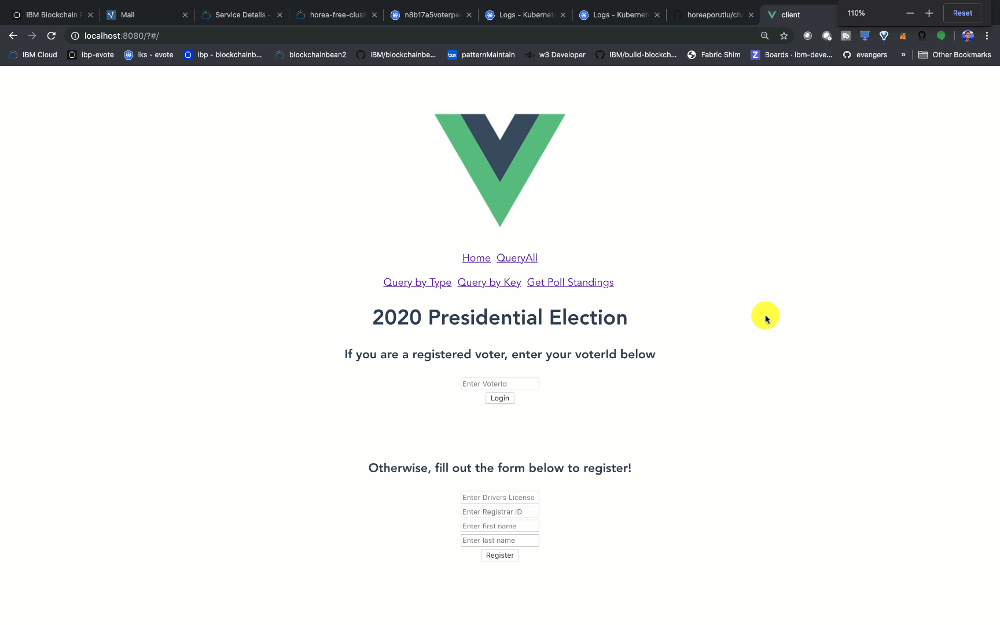
</p>
<br>

If we want to query for a particular voterId, we can do so in the `Query by Key` tab.
If we want to query by object, we can do so by clicking on the `Query by Type` 
tab, and entering a type, such as `voter`. This will return all voter objects 
that are currently in the state. `QueryAll` will return all objects in the state.

<br>
<p align="center">
  
</p>
<br>


## Extending the code pattern
Pull requests and contribution are always welcome. Remember that a code pattern is a path to a solution, 
and not a complete solution on its own. To make this a more complete solution,
this application can be expanded in a couple of ways:

  * Use an API to verify the drivers license to make sure it is valid, and registered with the DMV.
  * Use a more complex consensus mechanism where multiple organizations (DMV, US Federal Government, US State
  Government) have to approve a vote before it is successfully recorded onto the blockchain.
  * Use ordering service which uses Raft consensus mechanism.


## Troubleshooting

* If you get an error that says `Error: Calling register endpoint failed with error [Error: self signed certificate]`, you can get past this by adding `"httpOptions": {"verify": false}` to the certificateAuthorities section of the connection profile that was downloaded from IBM Blockchain Platform.

<br>
<p align="center">
  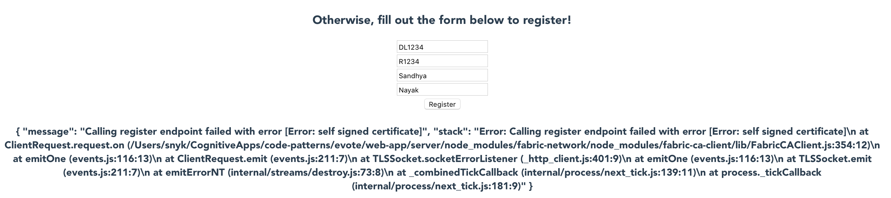
</p>
<br>

<br>
<p align="center">
  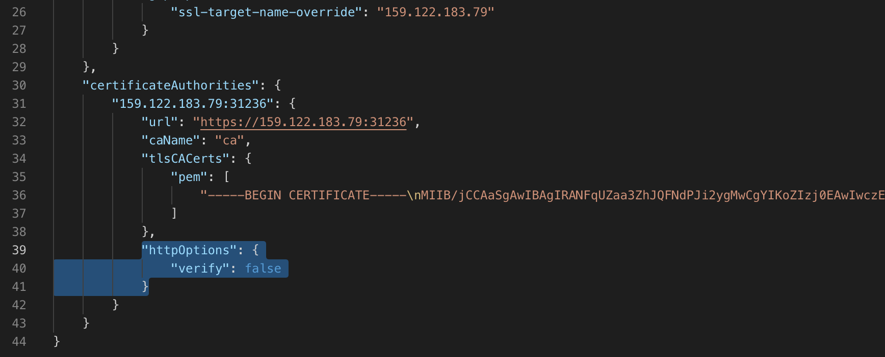
</p>
<br>


## Related Links
* [Hyperledger Fabric Docs](http://hyperledger-fabric.readthedocs.io/en/latest/)
* [IBM Code Patterns for Blockchain](https://developer.ibm.com/patterns/category/blockchain/)


## License
This code pattern is licensed under the Apache Software License, Version 2. Separate third-party code objects invoked within this code pattern are licensed by their respective providers pursuant to their own separate licenses. Contributions are subject to the [Developer Certificate of Origin, Version 1.1 (DCO)](https://developercertificate.org/) and the [Apache Software License, Version 2](https://www.apache.org/licenses/LICENSE-2.0.txt).

[Apache Software License (ASL) FAQ](https://www.apache.org/foundation/license-faq.html#WhatDoesItMEAN)
